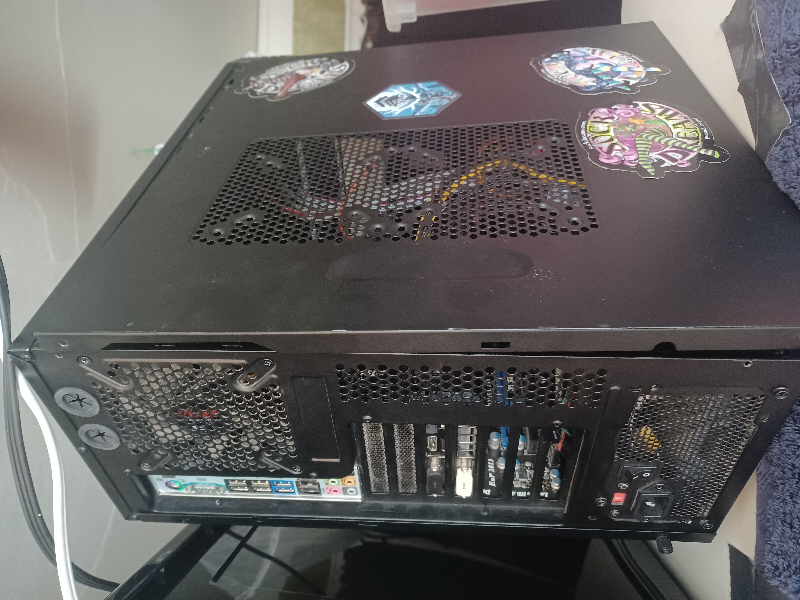
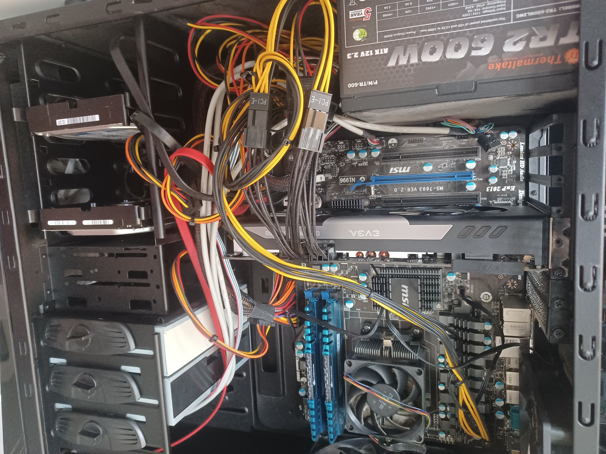
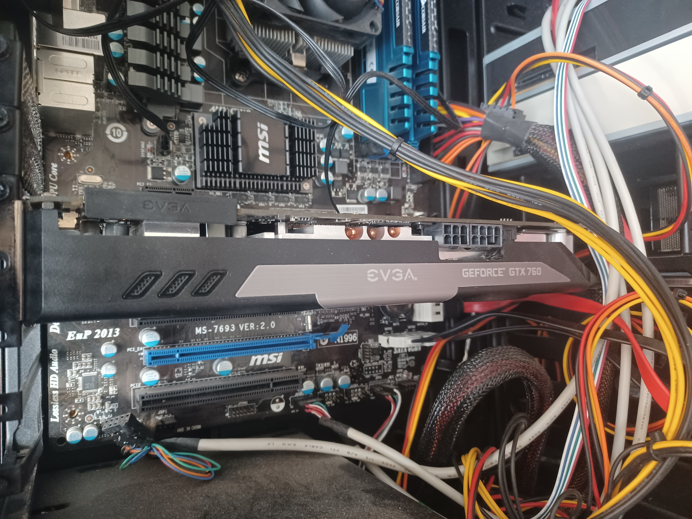
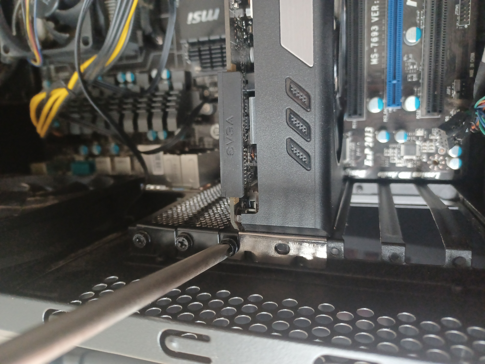
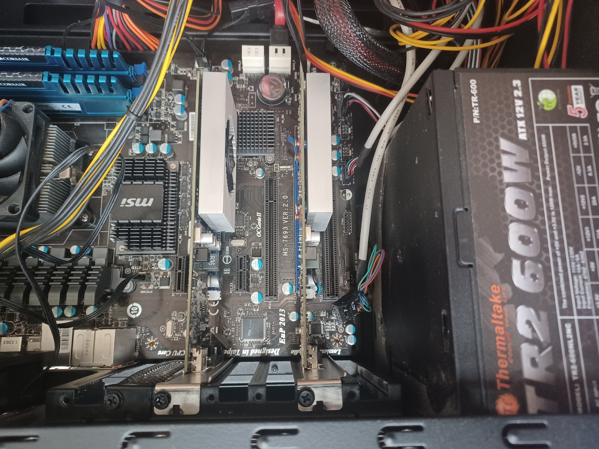
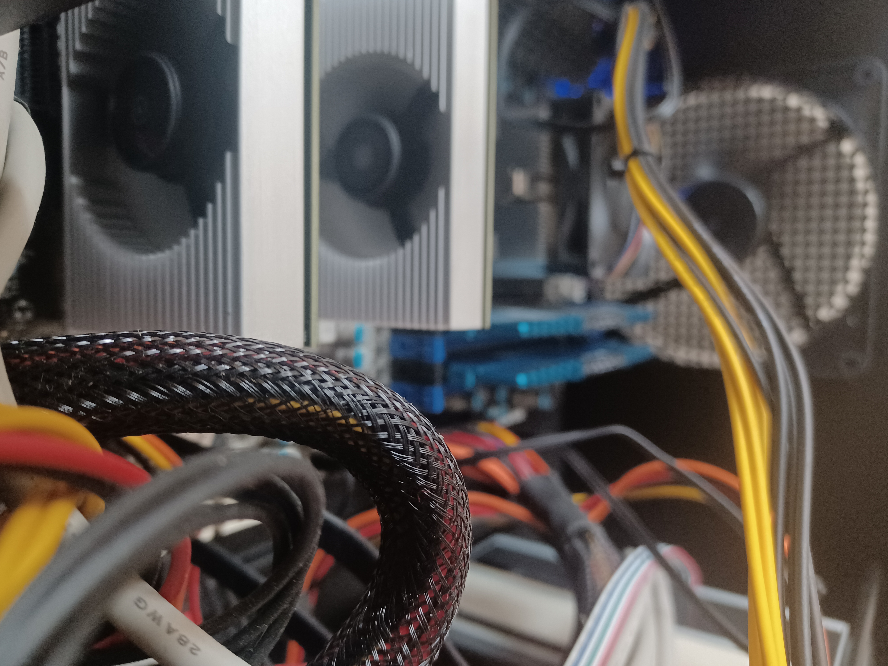

# Upgrade GPUS? (Optional)

Do you want to improve your Ravencoin mining rig? Here's a simple guide to add a new GPU to an old personal computer.

## Remove Parts

1. Unplug all cables. Open old PC case.

2. Find GPU. It will be a large circuit card that is plugged into the main circuit board (motherboard). Here it's the EVGA part *(center image)*.

3. Unplug all the sturdy power *(MOLEX)* cables from old GPU. They have clips, so get creative with pinching and wiggling.

4. Use ⊕ screwdriver to free old GPU from the back of the PC case. Carefully pull and wiggle the GPU out of the motherboard and put it aside somewhere clean and dry. *(Optional: make a little thank you intention for all the hard work this old GPU has done over the years.)*

## Install Parts

5. In the same slot on the motherboard, plug in a new GPU. Add another one if you like (and if your motherboard allows it).

6. Secure the the new GPU(s). Use the same screw hole in the back panel of the PC case, it ought to fit same as the old card. Power on the PC and verify the GPU fans are spinning.

:::success
New hardware upgraded!

Good Job! Now search for and grab the latest GPU performance software (driver) from the manufacturer.
:::success